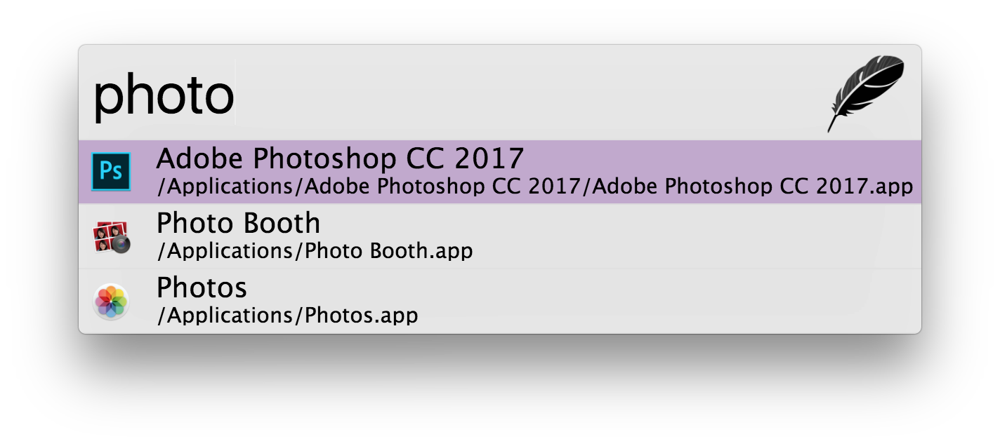

## Zazu

Zazu, is a cross platform and fully extensible and open source launcher for
hackers, creators and dabblers. Download it from the [releases
page](http://zazuapp.org/download).

Zazu was created to be a fully open source alternative to Alfred, but also be
completely plugin based. You can remove any functionality you don't like, so if
you hate the built in calculator, just get a new one!

We also have all of your configuration in a dotfile in `~/.zazurc.json` so it can
be backed up and synced!

Be sure to check out our amazing [Documentation](http://zazuapp.org).

## Action Shot

### Package Manager

Manage your plugins from within Zazu.

### Calculator

Accepts some common equations for you to copy to your clipboard.

### Clipboard History

Remembers things so you don't have to! Fuzzy search and browser all the things
you've copied.

### File Finder

Find Applications or files deep in your file system.

### System Commands

Switch on your screen saver, lock your computer, and more!

### Build your own!

Zazu is completely open, so build your plugins. You can [get started building
your plugin](http://zazuapp.org//documentation/plugins/) then head over and
submit it to the [plugins](http://zazuapp.org/plugins/) gallery!

## Development

As you might expect:

~~~
npm install
npm start
~~~

If you enable debug mode it will make it so Zazu won't hide and the dev tools
will open by default. You can enable debug mode by adding a `debug` flag to
`true` inside of your `~/.zazurc.json`

~~~ javascript
{
  "debug": true,
  "hotkey": "cmd+space",
  "theme": "tinytacoteam/zazu-playful-theme",
  "plugins": []
}
~~~

## Deployment

To deploy simple update the version in both `package.json` and
`app/package.json` (eg `0.3.2`). After comitting you can tag the release, but
be sure to add the `v` in front (eg `v0.3.2`). Push the commits then the tag.

The CI servers will upload the assets once the tests are done passing, the new
release should be a draft, so once all assets are published you can publish the
release on GitHub.

Lastly, you should re-publish the docs. Zazu uses the doc website to see if a
new release is available so doing a quick release will allow others to download
the newest version. Simply run `npm run docs:publish`.
